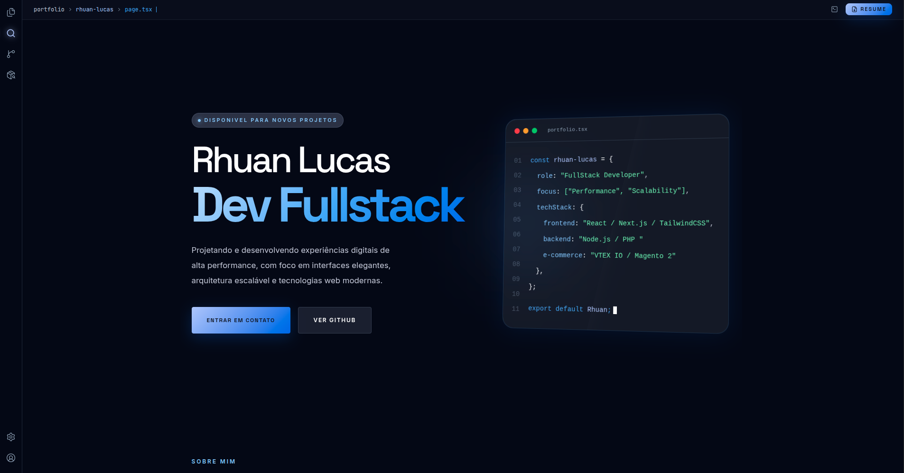

  

  <h1>💻 Portfolio v2 — Rhuan Lucas Carvalho</h1>

  

    Um portfólio moderno inspirado na interface do VS Code, desenvolvido para apresentar meus projetos, trajetória e habilidades como desenvolvedor front-end.
  

  

    
    
    
    
    
    
  

  

    <a href="#-preview">Preview</a> •
    <a href="#-features">Features</a> •
    <a href="#-tech-stack">Tech Stack</a> •
    <a href="#-running-locally">Running Locally</a> •
    <a href="#-project-structure">Project Structure</a>
  

---

<h2 id="-preview">📸 Preview</h2>

  

  O design utiliza uma estética inspirada no VS Code, com navegação lateral, seções organizadas como arquivos, tipografia limpa e uma paleta escura com destaque em tons de verde.

---

<h2 id="-features">✨ Features</h2>

<ul>
  <li>Layout totalmente responsivo</li>
  <li>Sidebar interativa inspirada no VS Code</li>
  <li>Seção Hero com apresentação profissional</li>
  <li>Sobre mim com stack e especialidades</li>
  <li>Seção de projetos com destaque para repositórios reais</li>
  <li>Timeline com trajetória de aprendizado e experiência</li>
  <li>GitHub Activity com gráfico de contribuições</li>
  <li>Call to Action para contato e networking</li>
  <li>Animações suaves com Framer Motion</li>
  <li>Deploy automático via Vercel</li>
</ul>

---

<h2 id="-tech-stack">🛠 Tech Stack</h2>

<table>
  <tr>
    <td><strong>Framework</strong></td>
    <td>Next.js 15</td>
  </tr>
  <tr>
    <td><strong>UI</strong></td>
    <td>React 19 + TailwindCSS</td>
  </tr>
  <tr>
    <td><strong>Linguagem</strong></td>
    <td>TypeScript</td>
  </tr>
  <tr>
    <td><strong>Animações</strong></td>
    <td>Framer Motion</td>
  </tr>
  <tr>
    <td><strong>Ícones</strong></td>
    <td>Lucide React</td>
  </tr>
  <tr>
    <td><strong>Deploy</strong></td>
    <td>Vercel</td>
  </tr>
</table>

---

<h2 id="-running-locally">🚀 Running Locally</h2>

<pre><code># Clone o repositório
git clone https://github.com/rhuanlucasdev/portfolio-dev.git

# Entre na pasta
cd portfolio-dev

# Instale as dependências
npm install

# Rode o projeto
npm run dev
</code></pre>

  Depois disso, abra <code>http://localhost:3000</code> no navegador.

---

<h2 id="-project-structure">📁 Project Structure</h2>

<pre><code>src/
├── app/
│   ├── page.tsx
│   ├── layout.tsx
│   └── globals.css
├── components/
│   ├── Sidebar.tsx
│   ├── Hero.tsx
│   ├── About.tsx
│   ├── Projects.tsx
│   ├── Timeline.tsx
│   ├── GithubActivity.tsx
│   ├── CTA.tsx
│   └── Footer.tsx
├── data/
│   ├── projects.ts
│   └── timeline.ts
└── lib/
</code></pre>

---

<h2>📌 Featured Projects</h2>

<ul>
  <li><strong>Gaming PC Builder</strong> — Plataforma para montar um setup personalizado no estilo “Mount your PC”.</li>
  <li><strong>Bikecraft React</strong> — Recriação do projeto Bikecraft em React com componentes reutilizáveis.</li>
  <li><strong>Finance App</strong> — Sistema de controle financeiro com arquitetura escalável.</li>
  <li><strong>Portfolio VS Code</strong> — Este próprio portfólio inspirado na interface do editor.</li>
</ul>

---

<h2>🎨 Design System</h2>

  A interface utiliza a seguinte paleta principal:

---

<h2>🌐 Deploy</h2>

  O projeto está hospedado na Vercel e configurado com domínio próprio.

<pre><code>npm run build
</code></pre>

  Sempre que um novo commit é enviado para a branch <code>main</code>, o deploy é realizado automaticamente.

---

<h2>🤝 Contato</h2>

  
  

---

  Desenvolvido por Rhuan Lucas Carvalho com muito café, dedicação e algumas horas olhando para o VS Code.

